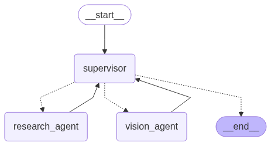

# Agentic AI with VLM
## Description:
Use Supervisor Agent pattern

**With math agent and research agent**

**With research agent and vision agent**

The vision could describe the image or counting the object in the image
